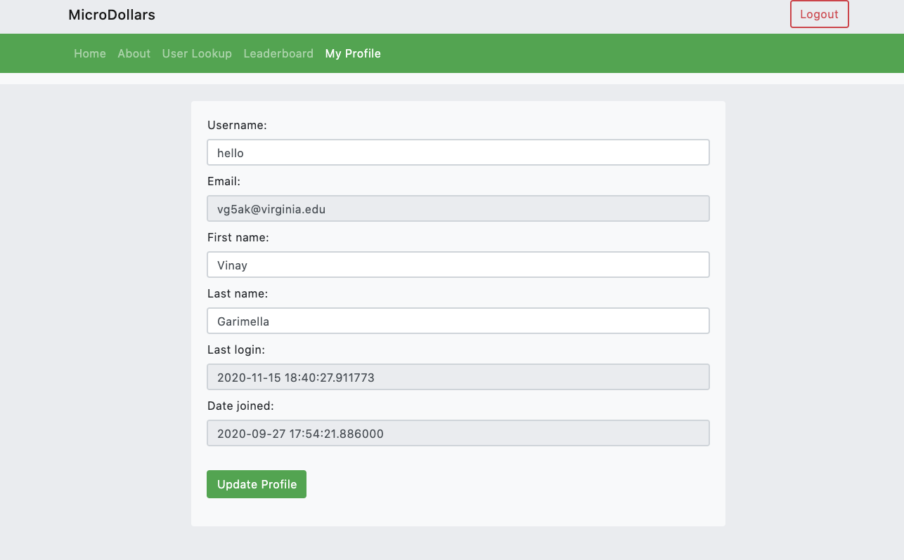

# project-1-38

MicroDollars
============

2JV Group 1-38
Jami Park Vasil Zhigilei Vinay Garimella John Kim
--------------------------------------------------------

How to use the Code
------------------

When pulling from github clear the database with

    git pull
    chmod +x ./updatedb.sh
    ./updatedb.sh

When pushing to github

    chmod +x ./exportdb.sh
    ./exportdb.sh
    git add .
    git commit -m "ENTER YOUR MESSAGE"
    git push

When running lazily (makes migrations, runserver for you):
Will run python manage.py makemigrations, migrate, and runserver in one command

    ./lazy.sh

Install the requirements
    pip install -r requirements.txt

The different features of the app
---------------------------------

This project was made by a group of University of Virginia students.

Below here are the different files and what information they contain.

Microdollars
-----------

Front Page Overview

Navigation Bar
--------------

Home
-----

This page is the main page where all users who sign in will automatically be sent to. The main content of this page is the cards that contain the organizations that you can donate to as well as information regarding the information. If you click on the organization card it will autofill the organization that will receive the donation in the donation form.

Below the picture cards are the donation form itself. The donation form consists of a drop-down menu where one can select an organization to donate to. A field to input the amount of money they want to donate to. Lastly, a comment that can be attached to the donation. In order for any payment to be made once a user fills out the organization, amount, and an optional comment, the Paypal button must be clicked. From there the user must supply their PayPal account information. Once Pay now is clicked the donation will be processed and visible in the admin space.

Fake PayPal Info
-------------
    email : sb-vikk23602810@personal.example.com
    Password: tZ+bm3Jn
    Email: sb-etutn3569238@personal.example.com
    Password: =G$i%i(9
    Email: sb-tprix3572050@business.example.com
    Password: "7>a_UW0

About
-----

This page contains an overview of the creation of the project and the objective of the site itself. It contains the information regarding the name of the group and links to Github repositories of all the members who contributed to its creation.

User Lookup
-----

This page contains a field where a user can input the name of another user. Once the submit button is clicked the user is able to see where and how many donations are made to. Below that there are statistics of all the user donations and a Pie graph showing the amount of money funded to different organizations. 

Leaderboard
-----

This page represents the gamification section of the website and allows users to see which user has donated the most amount of money. The table states the user’s name, amount donated and an emoji that represents how high up on the leader board they are.You can also click on the usernames on the leaderboard to perform a User Lookup.

My Profile
----------

This section allows logged in users to edit their profile information. The fields that can be edited include the username, first name, and last name.

Admin Space
-----------

Organizational Models
---------------------

The two main objects that can be used or added is the organization model and the users.

This is how you insert an organization into the website.
